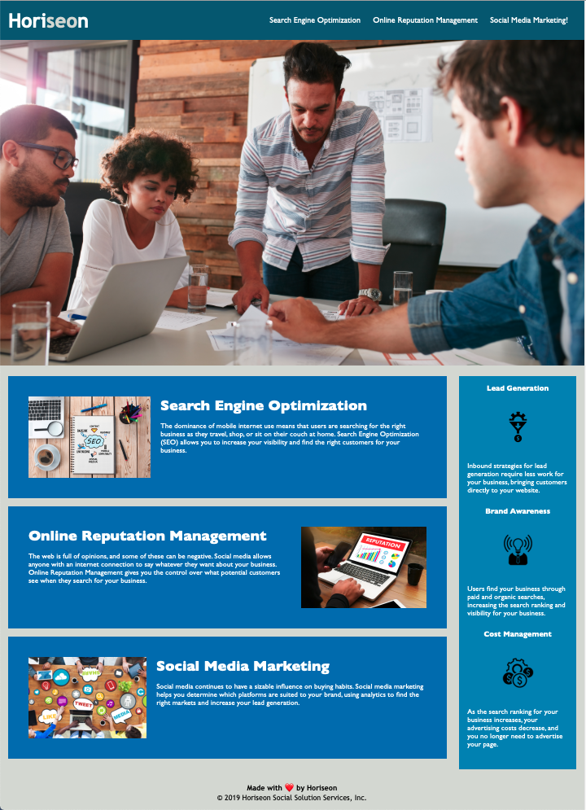

# Horiseon-Social-Solution-Services

## Description 

This is a homepage for marketing agency Horiseon. The codebase has been improved so that the site is more accessible and to improve its SEO.

This has been achieved by:
- Adding descriptive alt text to the images and icons in the HTML code
- Fixing broken links
- Adding semantic elements to the HTML code

## Installation

Follow the link below to view the webpage:

https://ekh-b.github.io/Horiseon-Social-Solution-Services/#social-media-marketing

## Usage 

This webpage is easy to navigate, either scroll down to see what services Horiseon offer or click the three sectons at the top of the page on the right hand side.

## Credits

HTML resources:

https://www.w3schools.com/html/html5_semantic_elements.asp

https://www.w3schools.com/tags/att_img_alt.asp

CSS Resources:

https://codecoda.com/en/blog/entry/css-selectors-properties-and-values

https://www.w3schools.com/css/css_comments.asp

Information on accessibility: 

http://www.davidmacd.com/blog/alternate-text-for-css-background-images.html

https://developer.mozilla.org/en-US/docs/Learn/Accessibility/HTML

https://generatepress.com/forums/topic/hero-image-elements-dont-bring-in-the-alt-tag/page/3/

## License

[MIT](https://choosealicense.com/licenses/mit/)

